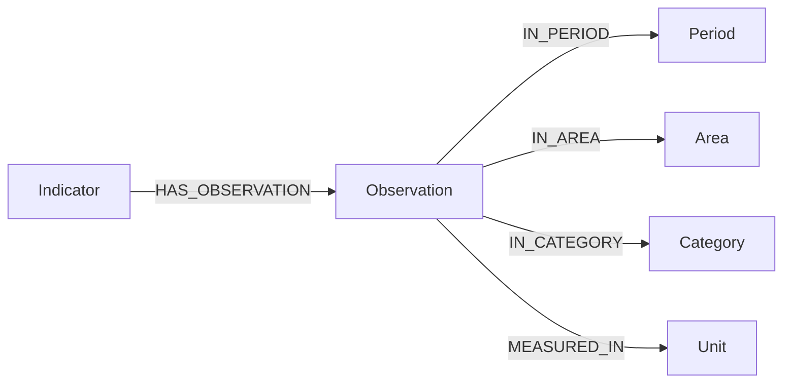

# Neo4j Knowledge Graph Guide: siat-verification

The `siat-verification` service utilizes a Neo4j knowledge graph storing **2.2 Million** published statistical observations across **3,326** indicators from the State Committee of Statistics SIAT database.

---

## 1. Graph Model & Schema

### Node Labels

| Label | Count | Primary Key | Description |
|---|---|---|---|
| `Indicator` | 3,326 | `id` / `code` | Statistical indicator classifier row. Contains `name_uz`, `name_ru`, `name_cyrl`, `level`, `path`, `periodicity`. |
| `Observation` | ~2,200,000 | `id` | Single measured statistical fact with numeric `value`. |
| `Period` | Variable | `code` | Time period specification (e.g., `2024`, `2025-Q2`, `2024-M03`). |
| `Area` | 200+ | `code` | Administrative territory (Republic of Uzbekistan, regions, Tashkent city, districts). |
| `Category` | Variable | `code` | Classifier dimension (e.g. partner country, economic activity sector). |
| `Unit` | Variable | `code` | Measurement unit (e.g. `ming so'm`, `tonna`, `foiz`). |

### Relationships



---

## 2. Fulltext Index (`indicator_fulltext`)

Neo4j contains a dedicated fulltext index named `indicator_fulltext` covering:
- Uzbek Latin names (`name_uz`)
- Uzbek Cyrillic names (`name_cyrl`)
- Russian names (`name_ru`)
- Classifier hierarchy path (`path`)

### Search Rules
1. **Apostrophe handling**: The Lucene analyzer splits on apostrophes, ensuring `o'`, `o‘`, `oʻ`, and `oʼ` match identically.
2. **Abbreviation expansion**: Four common national abbreviations are expanded before query submission:
   - `YaIM` → Gross Domestic Product (GDP)
   - `YaHM` → Gross Regional Product (GRP)
   - `YaQQ` → Gross Value Added
   - `INI` → Consumer Price Index (CPI)
3. **Number stripping**: Numbers and year tokens (e.g., `2024`, `8.5`) are stripped from name queries to prevent year numbers from distorting name rankings.
4. **Leaf filtering**: Only level 4 (`daraja = 4`) nodes are measurable indicators; levels 1–3 are classifier headings.

---

## 3. Cypher Query Patterns for AI Agents

### Exact Code Lookup
```cypher
MATCH (i:Indicator {code: $code})
RETURN i.id AS id, i.code AS code, i.name_uz AS nomi, i.level AS daraja, i.periodicity AS davriylik
```

### Observation Retrieval (Latest Periods with Area Filter)
```cypher
MATCH (i:Indicator {code: $code})-[:HAS_OBSERVATION]->(o:Observation)
MATCH (o)-[:IN_PERIOD]->(p:Period)
OPTIONAL MATCH (o)-[:IN_AREA]->(a:Area)
OPTIONAL MATCH (o)-[:MEASURED_IN]->(u:Unit)
WHERE ($hudud IS NULL OR a.name_uz =~ ('(?i).*' + $hudud + '.*'))
WITH p, o, a, u ORDER BY p.code DESC
RETURN p.code AS davr, o.value AS qiymat, a.name_uz AS hudud, u.name_uz AS birlik
LIMIT 20
```

---

## 4. Operational Instructions

To reload or inspect the graph dump:
- Use PowerShell on host: `.\scripts\restore_dump.ps1`
- Do not run restore from Git Bash (due to path mangling of `/dumps`).
